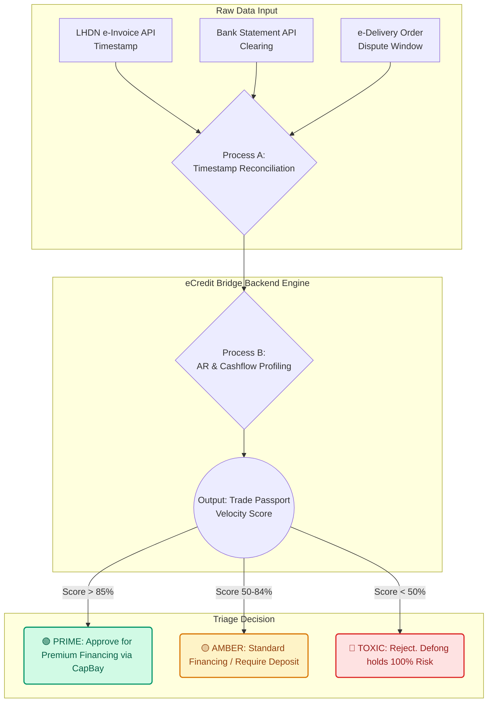

<div align="center">
  
# 🌉 eCredit Bridge
**Turning supply chain trust into financing power — backed by government data.**

**NexHack 2026 | Track 2: Fintech Risk & Fraud Intelligence**

[](https://trade-passport-engine-ntk9kfp23-jijo-jijis-projects.vercel.app/)
[](#)
[](#)

</div>

---

## 📌 Submission Links
- **[Pitch Deck]**: *(Insert Link Here)*
- **[7-Minute Demo Video]**: *(Insert Link Here)*
- **[Live Application]**: [trade-passport-engine.vercel.app](https://trade-passport-engine-ntk9kfp23-jijo-jijis-projects.vercel.app/)

---

## ⚠️ The Problem: The Blindspot & The Rate Problem

B2B supply chains, particularly in hardware and construction, operate as a "free ATM." Suppliers (like Defong/Apex Enterprise) face massive cash flow pressure, with millions locked in receivables (e.g., RM 1.4M locked out of RM 8M revenue).

- **The Visibility Problem**: Financiers cannot assess SME credit risk because traditional records are scattered (paper invoices, DO slips in boxes, WhatsApp confirmations).
- **The Rate Problem**: Because financiers face "blind risk," they charge high factoring interest rates. This destroys distributor margins (often <1%), meaning the cost of unlocking cash exceeds the benefit.

## 💡 The Solution: eCredit Bridge

**We do one thing: We act as the Data Layer between Trust and Financing.**

Leveraging Malaysia's **2024 LHDN e-invoice mandate**, we translate tacit SME relationships into institutional-grade credit data. By cross-referencing LHDN data with bank statements and delivery receipts, we generate a **Trade Passport**.

✅ **We never hold funds.**  
✅ **We require no lending license.**  
✅ **We eradicate blind risk premiums, enabling sustainable financing rates.**

---

## 🎯 Target Users & Market

Our initial target users are traditional SME hardware distributors and specialist contractors who suffer from heavy Accounts Receivable (AR) bleed.

- **TAM (The Unicorn Vision):** RM 340B+ (All B2B Trade Credit in Malaysia/SEA)
- **SAM (The Focus Area):** RM 45B (Construction & Hardware Supply)
- **SOM (The Survival Line):** First 50 Nodes (Defong's Immediate Network in Johor Bahru). 150 distributors x RM 500k avg AR = RM 375M fundable pool.

---

## ✨ Key Features

- **🛡️ The Unbreakable Trinity**: Fraud is prevented by requiring a 3-way match: LHDN e-Invoices + Bank Reconciliation + Confirmed Delivery Orders (DO). Falsifying this requires hacking the national tax system.
- **📈 Dynamic Credit Scoring**: The engine processes payment timeliness, transaction frequency, cooperation history, and volume trends to generate a real-time score (e.g., `PRIME`, `AMBER`, `TOXIC`).
- **📑 Automated Tear Sheets**: Packages verified assets and submits them directly to third-party financiers (e.g., CapBay) with explicit PDPA consent.

---

## 💰 Pricing & Business Model

Two revenue lines, zero lending risk.

### Line 1: SaaS (Supplier Pays)
- **Pricing**: Monthly fee of RM 200 - RM 500.
- **Value**: AR management, reconciliation, and debt-tracking tools.
- **Moat**: Daily operations run on our platform, making switching costs extremely high.

### Line 2: Factoring Commission (Financier Pays)
- **Pricing**: 0.5% per funded transaction.
- **Value**: Charged to financiers (e.g., CapBay). We hand them verified SME assets they mathematically could not otherwise access.

---

## ⚙️ Technical Architecture

Our MVP is a lightweight, serverless application designed for rapid data processing and API handoffs.

- **Frontend**: PHP & TailwindCSS Single Page Application (Advisory Dashboard).
- **Backend**: Python (Flask) Serverless API deployed on Vercel.
- **Logic Engine**: Evaluates "Velocity Math" (Promised vs. Actual Payment Days) combined with historical transaction frequency to route AR into specific risk tranches.

### Workflow Diagram



> **Note for Judges**: A detailed technical architecture diagram is also included in our pitch presentation deck.

---

## 🔌 LHDN MyInvois SDK API Mapping

To ensure enterprise robustness, eCredit Bridge integrates directly with the official Malaysian tax authority APIs. Below is the mapping of consumed LHDN SDK endpoints implemented in our pipeline:

| Integration Phase | SDK API Endpoint | Method | Purpose & Params |
|---|---|---|---|
| **1. Authentication** | `/connect/token` | `POST` | Authenticates eCredit Bridge with LHDN Identity Server using `grant_type=client_credentials` and `scope=InvoicingAPI`. |
| **2. Identity Validation** | `/api/v1.0/taxpayer/validate/{tin}` | `GET` | Validates downstream buyer registration details by checking their TIN against active SSM registry data (`idType`, `idValue`). |
| **3. Real-time Ingestion** | `/api/v1.0/documents/recent` | `GET` | Pulls verified e-Invoices issued between the supplier and buyers, filtering by `submissionDateFrom` and `status=Valid`. |
| **4. Fraud Reconciliation** | `/api/v1.0/documents/{uuid}/details` | `GET` | Retrieves full cryptographic e-Invoice hashes and status metadata to prevent double-financing and verify billing terms. |

---

## 🗺️ Roadmap & Implementation

- **Q3 2026**: ERP plugin integration development (SQL, AutoCount, SQL Account) and initial sandbox testing with LHDN SDK.
- **Q4 2026**: Pilot launch with selected construction suppliers and CapBay financing integration.
- **Q1 2027**: General availability release in Malaysia, expanding into retail and manufacturing distribution channels.

---

## 🚀 Running the Project Locally

1. **Clone the repository:**
   ```bash
   git clone https://github.com/jijo-jiji/trade-passport-engine.git
   cd trade-passport-engine
   ```

2. **Install dependencies:**
   ```bash
   pip install -r requirements.txt
   ```

3. **Run the Flask backend (API):**
   ```bash
   python api/index.py
   ```

4. **Run the Frontend (PHP):**
   Start a local PHP server in the root directory:
   ```bash
   php -S localhost:8000
   ```
   Then open `http://localhost:8000` in your browser.

---
<div align="center">
  <i>Built with ❤️ for NexHack 2026</i>
</div>
